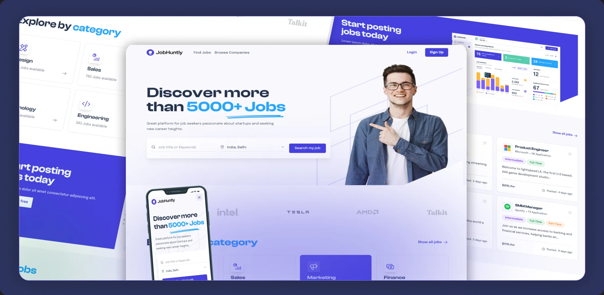

<div align="center">

<h1> Jobhunty • Job Search Platform </h1>
<p>JobHuntly is a modern job search landing page designed to <br> connect job seekers with top employers. It offers smooth scrolling, dynamic job listings, <br> and a clean, responsive UI for an enhanced user experience.</p>

<br/>

[](https://job-huntly-five.vercel.app/)


<br />
</div>

### Demo Screenshots

<div align="center">
  
</div>

<div align="center">
    
    
    


  </div>
  <br/>

# 🚀 Project Overview
**JobHuntly** Landing Page is a modern, responsive website designed as the front face for a job-search platform. It provides an engaging user experience for job seekers passionate about startups and those looking for new career opportunities.

The landing page features smooth scrolling, dynamic job categories, trusted company highlights, and a professional, user-friendly design built using React, React Router, and Lenis for smooth animations.


## 🌟 Features

- Search Functionality: Users can search for jobs using keywords and location filters.
- Dynamic Job Listings: Explore jobs categorized by roles like Full-Time, Part-Time, and Freelance opportunities.
- Trusted Companies: Showcases brands such as Tesla, Intel, Vodafone, and more that trust the platform.
- Featured Jobs: Highlights trending and high-paying job roles with details like salary, experience, and application count.
- Latest Job Openings: Displays newly added positions with global locations.
- Responsive Design: Fully optimized for all devices—desktop, tablet, and mobile.
- Smooth Scrolling: Enhanced navigation experience powered by Lenis.

## 🛠️ Tech Stack

- React: For building the UI components.
- React Router v6: For routing and navigation.
- Lenis: Smooth scrolling library for improved scroll performance.
- Tailwind CSS: Styling the components.


## 🚀 Getting Started
To view and run this project locally, follow these steps:


### Prerequisites

Before starting, make sure you have the following installed:

- [Git](https://git-scm.com/)
- [Node.js](https://nodejs.org/en)
- [npm](https://www.npmjs.com/) (Node Package Manager)

### Steps

1. **Clone the repository:**

    ```bash
    git clone https://github.com/psparwez/JobHuntly.git
    ```

2. **Navigate to the project folder:**

    ```bash
    cd JobHuntly
    ```

3. **Install the project dependencies using npm:**

    ```bash
    npm install
    ```
4. **Running the Project :** 

```bash
npm run dev
```

5. Open [http://localhost:5173/](http://localhost:5173/) in your browser to view the project.


You’re now ready to explore and customize **JobHuntly** locally!

---


### 📜 License

[MIT](https://choosealicense.com/licenses/mit/)

<br/>